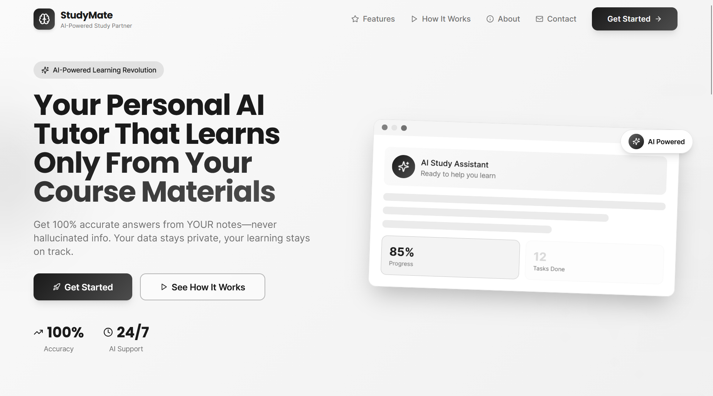
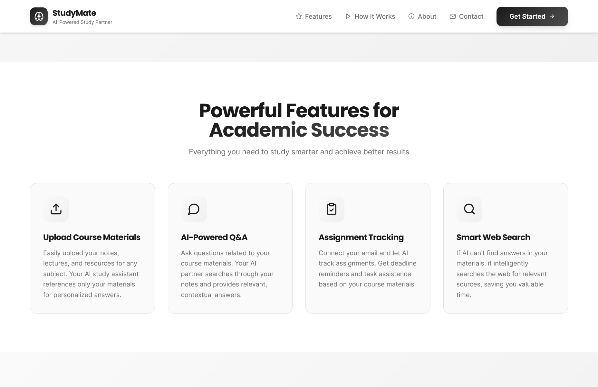
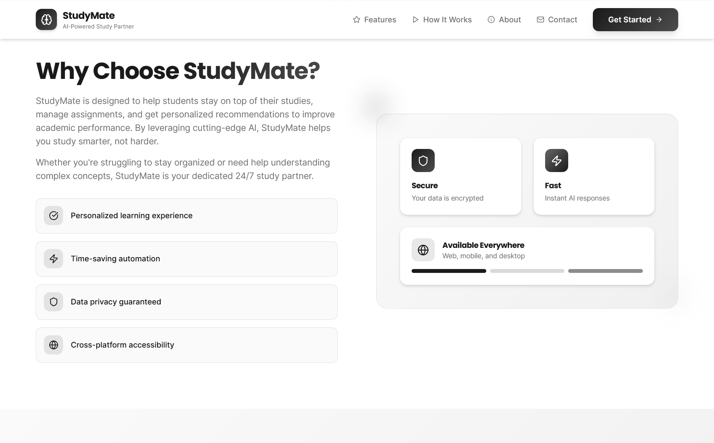
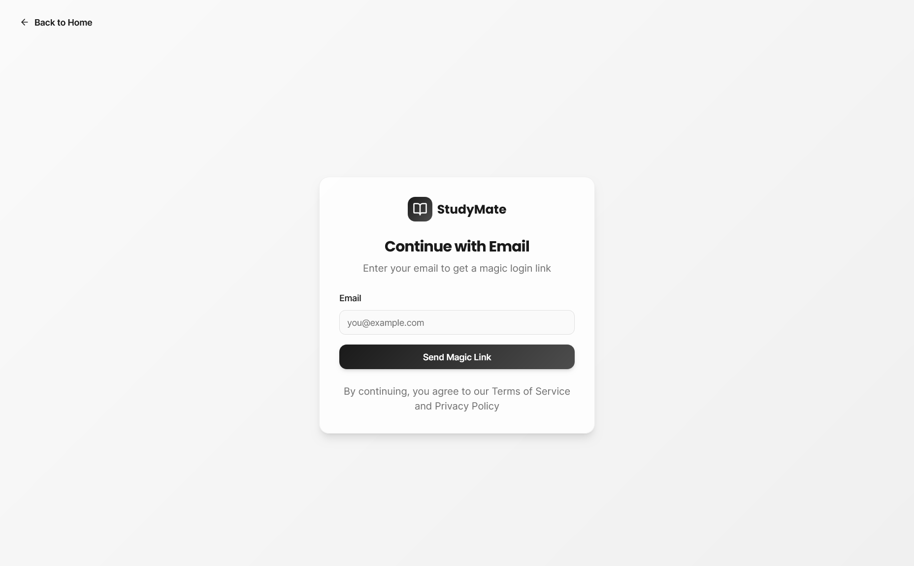
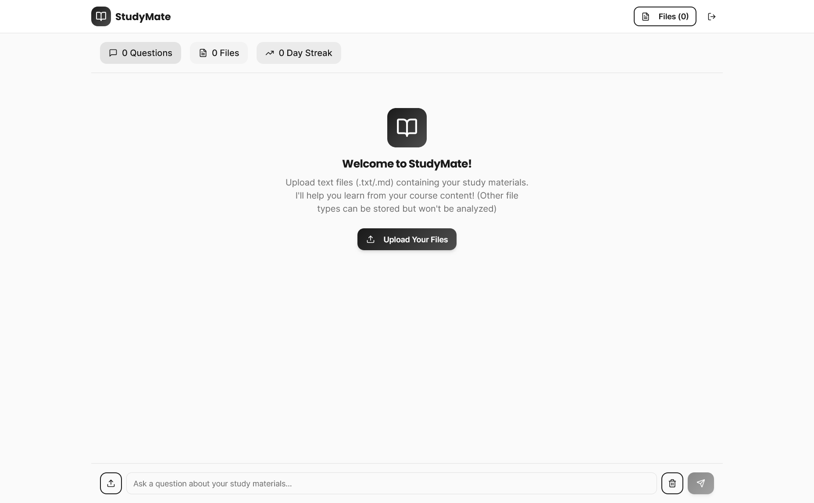
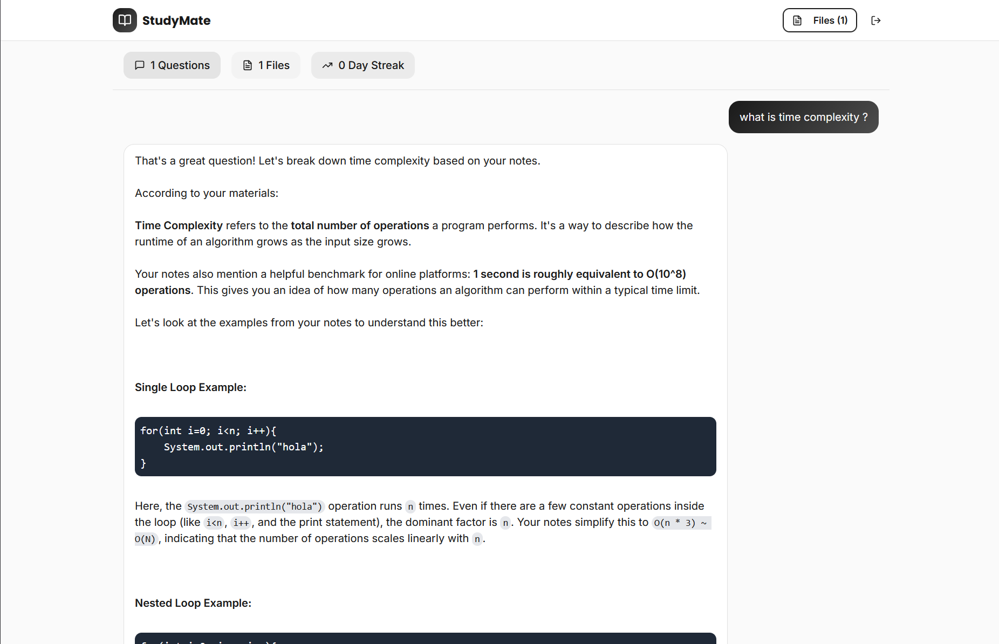
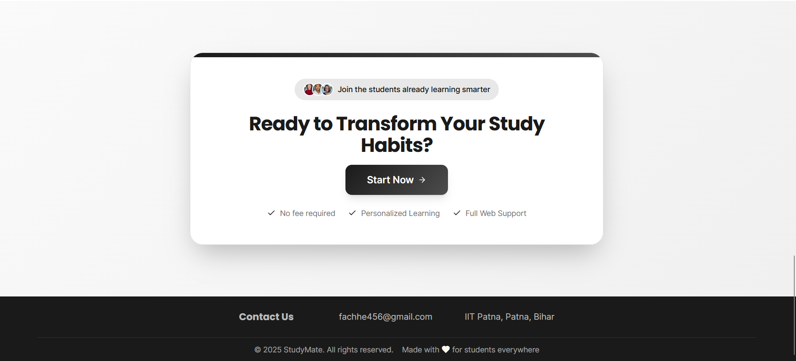

# AI Study Helper

An AI-powered study assistant that helps students understand concepts, summarize topics, and answers follow-up questions only from your notes, no hallucinated answers.

## 🚀 Live Demo
https://studymate-bice.vercel.app/

## 🧠 Features
- AI-powered Q&A using Google Gemini
- Structured study assistance
- Secure backend API (no exposed keys)
- User authentication
- Persistent study history

## 📸 Screenshots

### Home Page


### Features



### Signup


### Upload files


### Chat


### Contact us


## 🛠 Tech Stack
**Frontend**
- React
- TypeScript
- Tailwind CSS
- shadcn ui

**Backend**
- TypeScript (Serverless APIs)

**Database & Auth**
- Supabase

**AI**
- Google Gemini API

## 🏗 Architecture
Frontend → Backend APIs → Gemini API  
Frontend → Supabase (Auth & DB)

## 🔐 Security
- API keys stored in environment variables
- AI calls handled server-side
- Supabase Row Level Security enabled

## 📦 Deployment
- Source control: GitHub
- Hosting: Vercel
- Database: Supabase

## 🧪 Local Setup
```bash
git clone https://github.com/sanat-26/StudyMate.git
cd StudyMate
npm install
npm run dev
